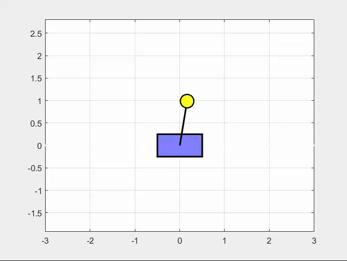
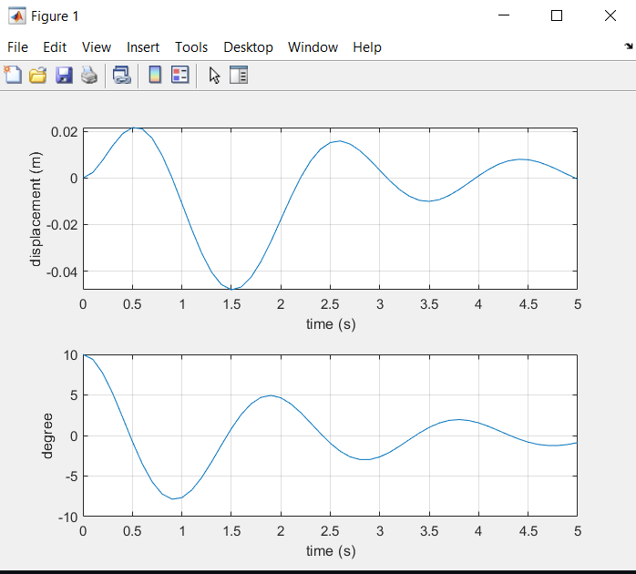

# cartpole_lqr_control
The repository is created to control a cart-pole system using LQR Control. In the following system, 
* pole mass m = 1 kg
* cart mass M = 10 kg
* link length L =  1 m
* time step dt = 0.1 s
* time range trange = 5 s
* gravitational acceleration g = 9.81 m/s^2

Initial conditions:
* pole angle: 10 degrees
* init velocity: 0 m/s

The pole placement method is also available in the *main.m* file and you can use it to comment out the *LQR* section and uncomment out *the pole placement* part.
And for animation, you also need to uncomment *Animation* part. 

The resulting LQR responses are the same as the following:

